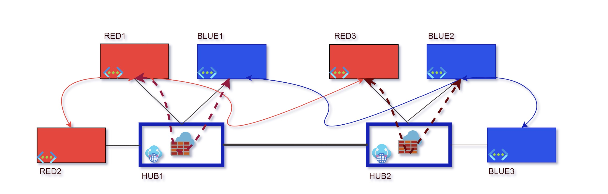
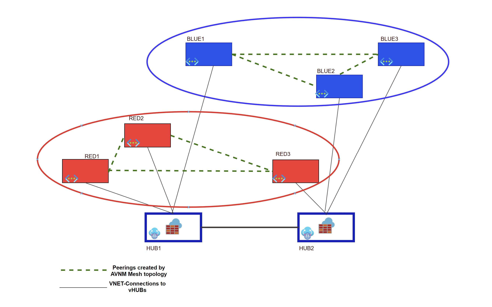
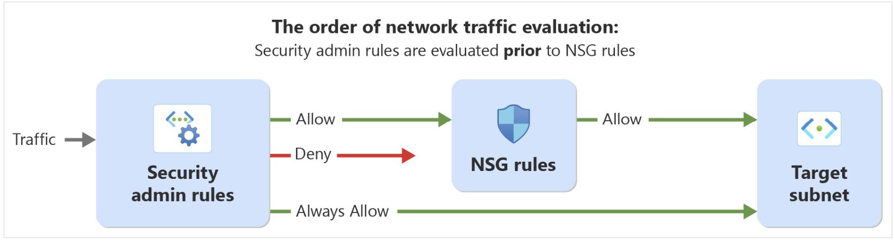

# Azure vWAN - A RED & BLUE puzzle solved with Virtual Network Manager

## The RED & BLUE stories

And here we are...back to the good old RED/BLUE scenario.

What's the RED/BLUE scenario?
You're right...I need to provide some context!! :) 

Imagine to have a vWAN-based connectivity ecosystem: 

- One or more Secured (or non-secured) vHUBs - in same or different regions
- Several spoke VNETs linked to the vHUBs
- Spoke VNETs hosting VMs/Services which can be logically split in different groups (i.e. different departments, prod/non-prod,etc..) - Like RED/BLUE in our example

Let's now say that our connectivity goal is the following:

- RED spokes must be able to communicate to other RED spokes linked to the same, or different, vHUBs, and **the communication must bypass any central Firewall**
- BLUE spokes must be able to communicate to other BLUE spokes linked to the same, or different, vHUBs, **the communication must bypass any central Firewall**
- The communication between REDs and BLUEs must be blocked

Several public articles from official MS documentation and from my great colleagues covered the topic already, in a wide range of all the possible relevant flavours: 

https://learn.microsoft.com/en-us/azure/virtual-wan/scenario-isolate-vnets-custom

https://learn.microsoft.com/en-us/azure/virtual-wan/scenario-isolate-virtual-networks-branches

https://blog.cloudtrooper.net/2022/12/19/vrfs-and-virtual-wan/

https://www.youtube.com/watch?v=m-GmkMFZ5WA 

...so why proposing this topic again?

Now, all the very well known publicly documented solutions for similar scenarios make use of a common vWAN instrument, the so called ***custom route tables***, with all the linked concepts of "RT association", "RT propagation", "Labels", etc...

***Custom route tables*** (and all relevant custom routing concepts) in vWAN are a powerful instrument, and for sure something really valuable, but at the same time characterized by an elevated degree of complexity, especially when your environment expands.

So I asked myself...*"Is Azure offering any possible alternative way to reach a similar result, with a lower degree of complexity"?*

The final solution should still leverage vWAN (for its embedded transit capabilities) but should as well ideally remove the complexity of the custom route tables management.

And this is when I thought at something which could potentially help...**Azure Virtual Network Manager**

## Azure Virtual Network Manager (AVNM)...how can it help??

**Azure Virtual Network Manager (AVNM)** is a management service that enables you to group, configure, deploy, and manage virtual networks globally across subscriptions and within the same subscription. 

With Virtual Network Manager, you can define network groups to identify and logically segment your virtual networks. Then you can determine the connectivity and security configurations you want and apply them across all the selected virtual networks in network groups at once.

This article is not meant to be an AVNM tutorial, but you can find here some excellent intro material to better understand the product (which today - March 2023 - is in Preview phase).

**WHAT IS?**
https://learn.microsoft.com/en-us/azure/virtual-network-manager/overview

**NETWORK GROUPS**
https://learn.microsoft.com/en-us/azure/virtual-network-manager/concept-network-groups

**CONNECTIVITY CONFIGURATIONS**
https://learn.microsoft.com/en-us/azure/virtual-network-manager/concept-connectivity-configuration

**SECURITY ADMIN RULES**
https://learn.microsoft.com/en-us/azure/virtual-network-manager/concept-security-admins

So how could finally AVNM help us for our scenario?

It's actually much simpler than what it could seem.

In AVNM, we have the concept of ***Network groups***

VNETs which are member of the same *Network group* can then be automatically interconnected in 2 different styles:

- HUB & Spoke topology (here you will decide which VNET will be your HUB, and all the other VNETs of the group will be automatically peered to your HUB, with the great possibility of building **automatic transitivity between spokes**)
- **Mesh** topology (where every VNET of the group is simply automatically connected to all the others, in a mesh network)

This second option is the one helping us for our scenario.

With the simple action of grouping our RED & BLUE VNETs in AVNM, and by providing ***mesh*** connectivity to such groups, a set of *VNET peerings* will automatically be established between all the members of the group.

Those *peerings* will be "hidden" (not directly visible from the VNET peering blade in the portal), but present.

The final result of grouping VNETs will be like in the following diagram:

What is the resulting connectivity model we achieved after this configuration?
Here it is:

- RED spokes (connected to same or different HUBs, including cross-region) will start communicating directly, and bypassing the HUB's FW - if present
- BLUE spokes (connected to same or different HUBs, including cross-region) will start communicating directly, and bypassing the HUB's FW - if present
- The traffic between RED and BLUE will be driven to FW, since no better route exists for such. It will be the Central FW deciding if to ALLOW or to BLOCK traffic

And what if I had no FW in my vHUBs*?
Is there a way to still block the traffic from RED to BLUE?

In such case, you could leverage again the concept of **SECURITY ADMIN RULES** offered by AVNM.

The link provided above gives you clear info about what these are, but to make it simple you can look at *Security Admin Rules* like at a sort of "Macro-NSG" applied to the context of you group of VNETs, evaluated with higher priority than any NSG deployed into the VNETs themselves.

With this feature, you could potentally easily prevent traffic from REDs to BLUEs by creating the relevant security rules for blocking traffic to cross-scopes.

Those rules would be automatically applied to all the VNETs in your group, and will have higher-priority compared with any NSG deployed in the VNETs.

'*' *Note: at present day, the vWAN InterHUB traffic via Firewall is a feature [RoutingIntent] which is not GA yet*

## Can this solution offer exactly the same as Custom Route Tables approach?

No, with vWAN's custom route tables you could manage to isolate the RED/BLUE groups from a routing perspective, so even if no FW was present in your HUB you could still block the traffic between the groups (real network-level segregation).

So we can look at the AVNM-based use case mainly as to a facilitation in bypassing centralized FWs without the need of route tables' configuration or direct manually-built peerings between spokes of the same group.

The possibility to leverage the *Security Admin Rules* - despite being conceptually different by network segregation - still offers the possibility to leverage this option as well for scenarios without centralized FW solutions.

In a next article, I'll show you how to use AVNM to achieve a similar connectivity pattern!

Enjoy :)
